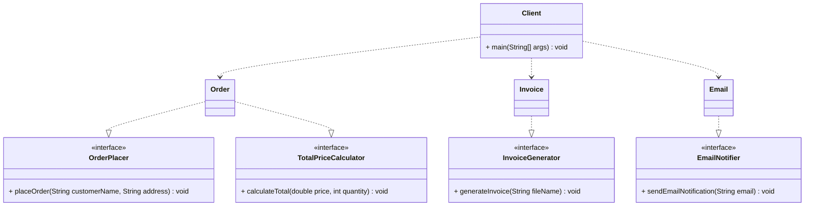

### Improve the following codes to implement SOLID principles in OOP.

```java
public interface Order {
	void calculateTotal(double price, int quantity);
	void placeOrder(String customerName, String address);
	void generateInvoice(String fileName);
	void sendEmailNotification(String email);
}
```

```java
public class OrderAction implements Order {
	@Override
	public void calculateTotal(double price, int quantity) {
		double total = price * quantity;
		System.out.println("Order total: $" + total);
	}
	
	@Override
	public void placeOrder(String customerName, String address) {
		// Simulate placing order in a system
		System.out.println("Order placed for " + customerName + " at " + address);
	}
	
	@Override
	public void generateInvoice(String fileName) {
		// Simulate generating invoice file
		System.out.println("Invoice generated: " + fileName);
	}
	
	@Override
	public void sendEmailNotification(String email) {
		// Simulate sending email notification
		System.out.println("Email notification sent to: " + email);
	}
}
```

```java
public class OrderTest {
	public static void main(String[] args) {
		Order order = new OrderAction();
		order.calculateTotal(10.0, 2);
		order.placeOrder("John Doe", "123 Main St");
		
		// These methods might not be needed for all orders
		order.generateInvoice("order_123.pdf");
		order.sendEmailNotification("johndoe@example.com");
	}
}
```

# UML Diagram

